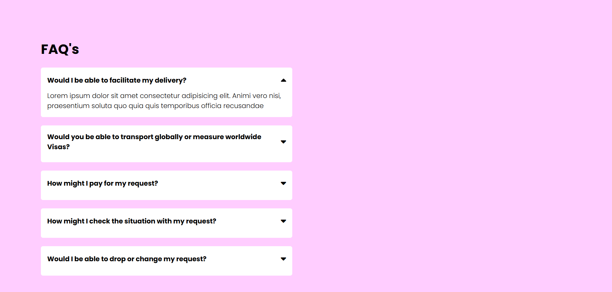

# 📂 Accordion Project

A simple **FAQ Accordion** built with **HTML, CSS, and JavaScript**.  
This project demonstrates how to build collapsible Q&A sections where only one answer is visible at a time.

---

## 📸 Screenshot



---

## 🚀 Features

- Expand/collapse FAQ-style questions.
- Smooth transition animation.
- Only one answer can stay open at a time.
- Interactive caret icon rotates when opened.
- Responsive design (works on different screen sizes).

---

## 🛠️ Technologies Used

- **HTML5** – Markup structure for FAQs  
- **CSS3** – Styling, transitions, and responsiveness  
- **JavaScript (ES6)** – Accordion toggle functionality  

---

## 📂 Project Structure
<pre>
accordion/
├── Screenshot/
│ └── Accordion.png # Project screenshot
├── index.html # Main HTML file
├── style.css # Styling for the accordion
└── script.js # Accordion functionality
</pre>


---

## ⚡ How to Run


1. Clone this repository:
   ```bash
   git clone https://github.com/mohammad-sameer76/JS-mini-projects.git
Navigate to the project folder:

bash

2. cd JS-mini-projects/Accordion
Open index.html in your browser.

🎯 Future Improvements
Add support for multiple accordions open at the same time.

Smoothen the animation with variable height detection.

Improve accessibility with ARIA attributes.

👨‍💻 Author
Developed by Mohammad Sameer ✨
Feel free to contribute or suggest improvements!
