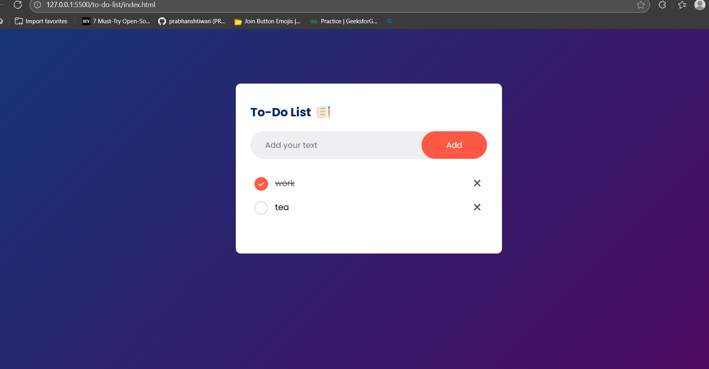

# ✅ To-Do List

A simple and interactive **To-Do List application** built with **HTML, CSS, and JavaScript**.  
This project allows users to add, check off, and delete tasks with a clean UI.

---

## 📸 Screenshot



---

## 🚀 Features

- ➕ Add new tasks easily.  
- ✔️ Mark tasks as complete with a check icon.  
- ❌ Delete tasks with one click.  
- 💾 Saves tasks in local storage (persists after refresh).  
- 🎨 Clean and responsive UI with gradient background.  

---

## 🛠️ Technologies Used

- **HTML5** – Structure of the app  
- **CSS3** – Styling and responsive design  
- **JavaScript (ES6)** – Task management and local storage functionality  

---

## 📂 Project Structure

to-do-list/
├── index.html # Main HTML file
├── style.css # Styling for UI
├── script.js # Functionality (add, check, delete, local storage)
├── images/ # Icons used in the project
│ ├── checked.png
│ ├── unchecked.png
│ └── icon.png
└── screenshots/
└── to-do.png # Project screenshot


---

## ⚡ How to Run

1. Clone or download this repository:
   ```bash
   git clone https://github.com/your-username/todo-list.git
Open the index.html file in your browser.

🎯 Future Improvements
Add edit functionality for tasks.

Implement categories/tags for better organization.

Add due dates and reminders.

Dark mode toggle.

👨‍💻 Author
Developed by Mohammad Sameer ✨
Feel free to contribute or suggest improvements!


