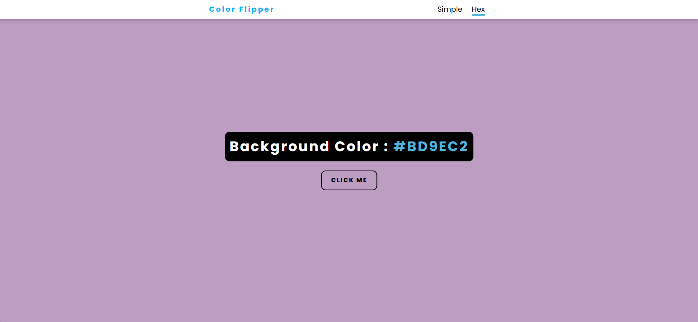

# 🎨 Background Color Flipper

A simple and fun **Background Color Flipper** built with **HTML, CSS, and JavaScript**.  
This mini project allows users to change the background color with a single click — either to random color names or random hex color codes.

---

## 📸 Screenshot


---

## 🚀 Features

- 🎨 Changes background color with one click.  
- 🔢 Supports two modes:
  - **Simple Mode:** Uses basic color names (red, green, blue, etc.).  
  - **Hex Mode:** Generates random hex color codes (`#A1B2C3`).  
- ⚡ Lightweight and fast — runs directly in the browser.  
- 💻 Responsive and beginner-friendly project.

---

## 🛠️ Technologies Used

- **HTML5** – Structure  
- **CSS3** – Styling  
- **JavaScript (ES6)** – Color flipping logic  

---

## 📂 Project Structure

bg-color-flipper/
├── index.html # Simple color flipper
├── script.js # Simple color logic
├── hex.html # Hex color flipper
├── hex.js # Hex color logic
└── style.css # Styling


---

## ⚡ How to Run

1. Clone this repository:
   ```bash
   git clone https://github.com/mohammad-sameer76/JS-mini-projects.git
2. Navigate to the project folder:
cd bg-color-flipper
Open index.html or hex.html in your browser.

🎯 Future Improvements
Add RGB color mode.

Display the current color value more clearly.

Add copy-to-clipboard for hex codes.

Include a dark/light theme switcher.

👨‍💻 Author
Developed by Mohammad Sameer ✨
Feel free to fork, star ⭐, or contribute!