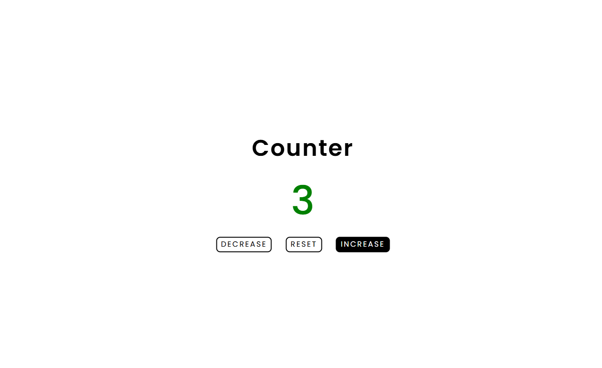

# Counter App

A simple web-based counter application that allows users to increment, decrement, and reset a numerical value.

## Features

- Increment the counter value
- Decrement the counter value
- Reset the counter to zero
- Dynamic color changes based on value:
  - Green for positive numbers
  - Red for negative numbers
  - Black for zero

## Technologies Used

- HTML5
- CSS3
- JavaScript (Vanilla)

## How to Run

1. Clone or download the repository.
2. Navigate to the project folder:
   cd JS-mini-projects/counter
3. Open the `index.html` file in a web browser.

## Screenshots

## Project Structure

- `index.html`: Main HTML file
- `style.css`: CSS styles
- `script.js`: JavaScript logic
- `screenshot/`: Folder containing screenshots
