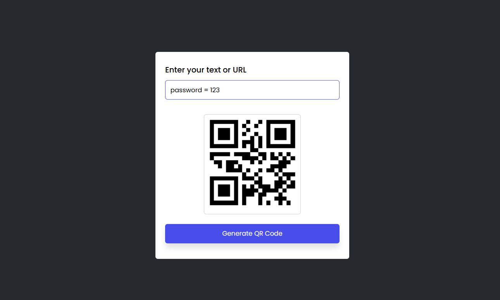

# 📱 QR Code Generator

A simple and responsive **QR Code Generator** built with **HTML, CSS, and JavaScript**.  
This app generates QR codes instantly from user input using the free [GoQR API](https://goqr.me/api/).

---

## 📸 Screenshot



---

## 🚀 Features

- 🔤 Enter text or a URL to generate a QR code.  
- ⚡ Real-time QR code generation using an API.  
- 🖼️ Displays generated QR code inside the app.  
- 🎨 Clean, modern, and responsive UI.  
- 🧾 Error handling for empty input.  

---

## 🛠️ Technologies Used

- **HTML5** – Page structure  
- **CSS3** – Styling and responsive design  
- **JavaScript (ES6)** – QR code generation logic  
- **QR Server API** – Free API for generating QR codes  

---

## 📂 Project Structure

qr-code-generator/
├── index.html # Main HTML file
├── style.css # Styling
├── script.js # QR generator logic
└── screenshot/
└── qr-screenshot.png # Project screenshot


---

## ⚡ How to Run

1. Clone or download this repository:
   ```bash
   git clone https://github.com/mohammad-sameer76/qr-code-generator.git
Open index.html in your browser.

🎯 Future Improvements
Download button for generated QR codes.

Option to select QR size and colors.

History of generated QR codes.

Dark/Light theme toggle.

👨‍💻 Author
Developed by Mohammad Sameer ✨
Feel free to contribute or suggest improvements!