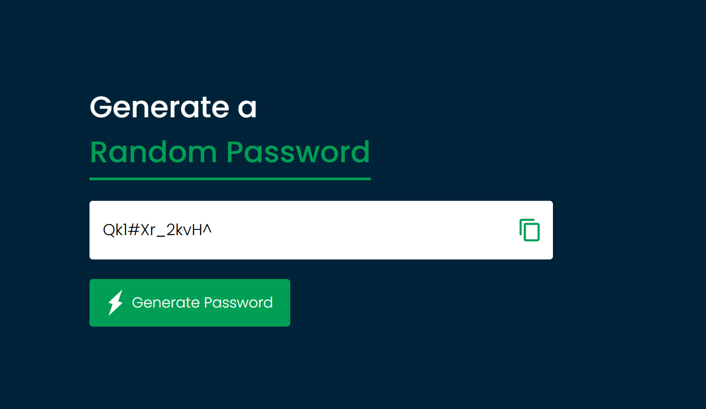

# 🔐 Random Password Generator

A simple and responsive **Random Password Generator** built with **HTML, CSS, and JavaScript**.  
This project generates strong random passwords using uppercase letters, lowercase letters, numbers, and symbols. Users can copy the generated password with a single click.

---

## 📸 Screenshot



---

## 🚀 Features

- 🔑 Generates strong random passwords.  
- 🔄 Uses uppercase, lowercase, numbers, and special symbols.  
- 📋 One-click **copy to clipboard** functionality.  
- 🎨 Clean and modern UI with responsive design.  
- ⚡ Lightweight and runs directly in the browser.  

---

## 🛠️ Technologies Used

- **HTML5** – Page structure  
- **CSS3** – Styling and layout  
- **JavaScript (ES6)** – Password generation logic and clipboard functionality  

---

## 📂 Project Structure

random-password-generator/
├── index.html # Main HTML file
├── style.css # Styling
├── script.js # Password generator logic
├── images/ # Icons used
│ ├── copy.png
│ └── generate.png
└── screenshot/
└── app-screenshot.png # Project screenshot

---

## ⚡ How to Run

1. Clone or download this repository:
   ```bash
   git clone https://github.com/your-username/random-password-generator.git
Open index.html in your browser.

🎯 Future Improvements
Allow users to select password length.

Let users choose which character sets (uppercase, numbers, symbols) to include.

Add password strength indicator.

Dark/Light theme toggle.

👨‍💻 Author
Developed by Mohammad Sameer ✨
Feel free to contribute or suggest improvements!
